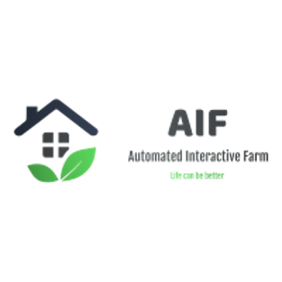

# *MyPlant*

*Това е мобилно приложение към AI Farm (системата ни за автоматизирано отглеждане на растения). Главната му функционалност е да предоставя лесен контрол над системата и бърз поглед върху състоянието на растенията.*

## Презентация
[Линк към ресурса](screenshots/other/MyPlant.pptx)

## Линк към уебсайта ни за администрация на AI Farm
http://aif.guide.bg/

## Как да си сваля и използвам проекта?

### Инструкции за сваляне
*TODO*

1) ...
2) ...
3) ...

### Инструкции за инсталация
*TODO*

1) ...
2) ...
3) ...

### Инструкции за стартиране на проекта
*TODO*

1) ...
2) ...
3) ...

## Използвани технологии

* Ionic https://ionicframework.com/ - *Cross-platform apps built with the web*
* React.js https://reactjs.org/ - *JavaScript библиотека за UI*
* Chart.js https://www.chartjs.org/ - *JavaScript charting библиотека*

## Информация за авторите на проекта

* **Бойко Георгиев** - *програмист, дизайнер, даде идеята* - Boyko03 https://github.com/Boyko03/
* **Евгений Атанасов** - *програмист, дизайнер, предложи технологиите* - evgenu https://github.com/evgenu/
