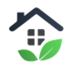

# *MyPlant*

*Това е мобилно приложение към AI Farm (системата ни за автоматизирано отглеждане на растения). Главната му функционалност е да предоставя лесен контрол над системата и бърз поглед върху състоянието на растенията.*

## Презентация
[Линк към ресурса]](link)

## Линк към уебсайта ни за администрация на AI Farm
http://aif.guide.bg/

## Как да си сваля и използвам проекта? (задължително)

### Инструкции за сваляне
*Тук опишете стъпка по стъпка как потребител, който си няма понятие от софтуер в github, да си свали и използва проекта*

1) ...
2) ...
3) ...

### Инструкции за инсталация
*Тук опишете стъпка по стъпка как потребител, който си няма понятие от софтуер в github, да си инсталира проекта ви*

1) ...
2) ...
3) ...

### Инструкции за стартиране на проекта
*Тук опишете стъпка по стъпка как потребител, който си няма понятие от софтуер в github, да стартира проекта ви*

1) ...
2) ...
3) ...

## Използвани технологии

* Ionic https://ionicframework.com/ - cross-platform apps built with the web *
* React.js https://reactjs.org/ JavaScript библиотека за UI *
* Chart.js https://www.chartjs.org/ JavaScript charting библиотека *

## Информация за авторите на проекта

* **Бойко Георгиев** - *програмист, дизайнер, даде идеята* - Boyko03 https://github.com/Boyko03/
* **Евгений Атанасов** - *програмист, предложи предложи технологиите* - evgenu https://github.com/evgenu/

### Всякакви допълнителни модификации по README-то са добре дошли (Лиценз, contributing.md, и т.н.) :)
README-template.md
Displaying README-template.md.